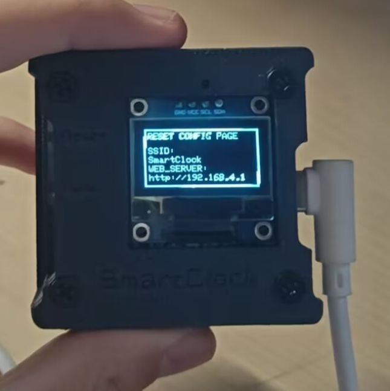
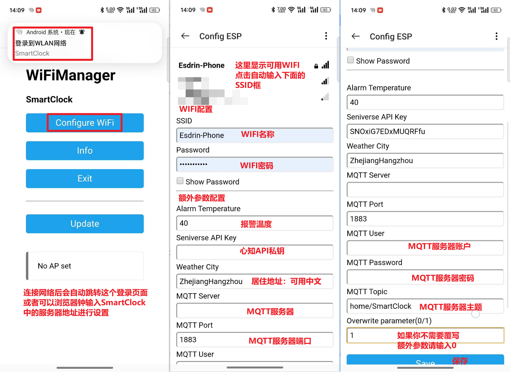
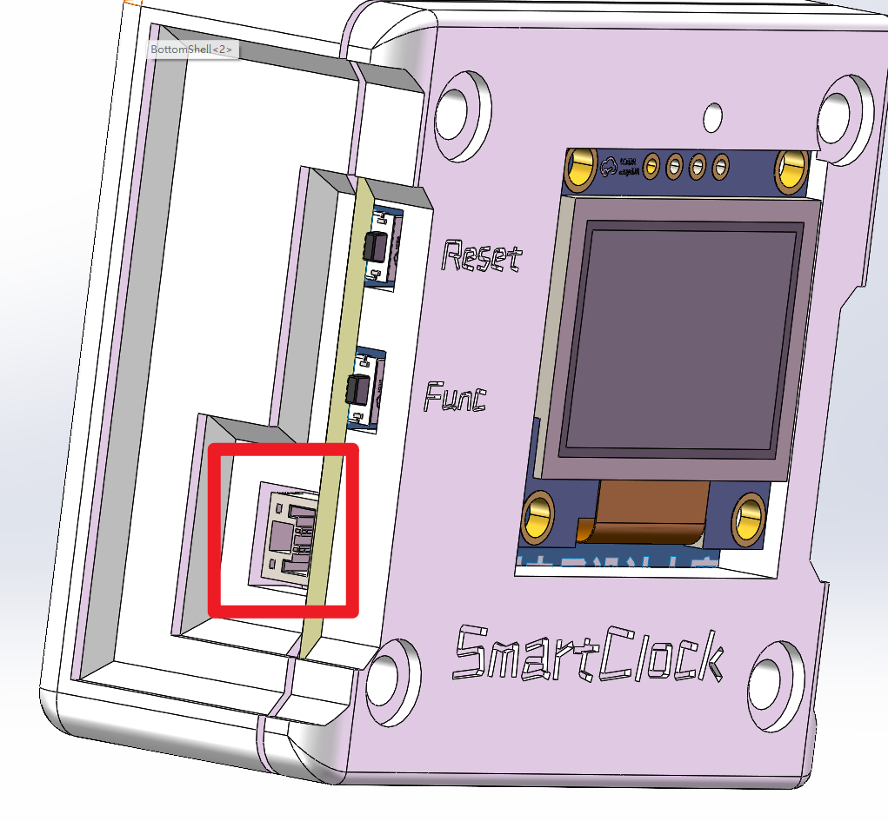

# SmartClock

如你所见，这是一个基于`esp32的智能时钟`项目

## 前言

本项目自开始（`嘉立创第九届电子设计大赛`）至结束总共花了差不多`1个月`时间，我是一个电设小白，我在这一个月中学习了一些奇奇怪怪有用的知识，这边感谢一下群里的各位佬对我的大力支持，我能`独立完成`这个项目真的很开心（快猝死了）。

本项目为`首次公开`，为`本人原创`项目。项目`未曾在别的比赛中获奖`。

## 项目介绍

本项目是一款针对现代智能家居环境设计的`温湿度监测与时间管理装置`，旨在解决家庭及小型办公空间对环境舒适度与时间同步管理的需求。通过集成`ESP32微控制器`和`SHT40传感器`，我实现了一套`实时监测并远程报告室内温度和湿度`的系统，有效提升了居住和工作环境的舒适度。~~低功耗设计~~和`内置电池`确保了设备的持续运行，无需频繁充电。同时，模块`具备时钟`功能，解决了家中或办公室缺少统一时间显示的问题，方便用户安排日程。

## 复刻金额

如果你是一个专业的电子工程师，那么`复刻的成本在45RMB左右`。

如果不是，那么请准备好以下工具：焊台、电烙铁、热风枪等焊接器具。

## 功能列表

- [x] 温湿度检测（盛思锐的sht40模块）
- [x] 时间显示（网络ntp）
- [x] 日期显示（时间转换）
- [x] 天气显示（心知API）
- [x] 温度过热报警
- [x] MQTT服务的支持（或许你可以连到米家上？）
- [x] 允许使用web服务器进行配置
- [x] UI图像（自己画的，勿喷）

##  文件夹目录

- Firmware：本项目的代码，基于PlatformIO平台
- Model： 本项目的模型文件，基于soildworks 2024
- Picture：本项目的UI图片，自己PS画的
- OrderFile：下单文件
- Assets：Markdown资源文件

## 功能简介

### 主屏幕

如图所见，这是它的`主屏幕`。

### 按钮功能

侧边使用双按钮，分别为`Reset（重置按钮）`和`Func（功能）`

#### Reset按钮

- **重启**（按1s后松开）：`立马`校准时钟，天气等。
- **重置**（长按5s以上）：`重新设置`WIFI、服务器、天气API等参数。

#### Func按钮

等你创造（写一些时钟不该有的功能的任务就交给你们了！）

### 主控

采用esp32，集成WIFI、蓝牙，淘宝上15块钱包邮到家。

### 配置界面

第一次启动会自动进入配置模式，你也可以使用下面的`reset按键`进行重置参数后也会自动进入。

配置过程：

- 首先你需要找到一个叫做`SmartClock`的WIFI并`连接`。（可以在`Firmware/src/Config.h`中调节`AP_NAME`来更改WIFI名称）
- 浏览器中输入小屏幕中的`WEB_SERVER`地址，也可以下拉通知栏点击`登录到WLAN网络`。
- 按照下图进行配置具体参数。

### 温度采集模块

采用`SHT40`模块，可以使用嘉立创的[SHT40-AD1B with pin模块](https://item.szlcsc.com/item/24072575.html),也可以淘宝上去买这个芯片（4块包邮）

### OLED屏幕

采用`0.96寸OLED屏幕`，淘宝应该是13左右，立创商城价格和淘宝差不多。

### 天气

采用[心知天气API](https://www.seniverse.com/)，可以去他们官网申请他们的免费版本，在配置界面填入他们给的私钥以及您当前所属的区域就行。默认更新频率是`每2小时一次`，可以调节`Firmware/src/Config.h`中的`WEATHER_INTERVAL`进行配置

### MQTT

MQTT功能是为了一些大佬想把这个设备接入自己的生态的功能，他会以`每分钟1次`的频率向服务器发送温度传感器的数据，频率可以在`Firmware/src/Config.h`中调节`MQTT_PUBLISH_INTERVAL`进行控制。

### 温度报警

当`检测温度大于配置的值`的时候，将会给输出的口一个`高电平`，否则为低。（一般情况下用不到）

### 时钟

时钟主要以**本机时钟为主、网络时钟为辅**的策略，默认网络校准频率为`每10分钟一次`，可以调节`Firmware/src/Config.h`的`NTP_UPDATE_INTERVAL`进行配置。

**如果您不在中国**，想要改变时区，可以调节`Firmware/src/Config.h`的`TIME_OFFSET`参数。

**默认ntp（网络校准服务器）由阿里云提供**，可以在`Firmware/src/Config.h`的`NTP_SERVER`进行更改。

### 电池管理

电池采用：582728-400毫安（淘宝10块一个）

电池管理芯片：ME4064（5毛一个）

电源管理芯片：RT9013（好像也是5毛）

### PCB

这边就不得不夸一下**不以卖板赚钱，以培养工程师为己任**的`嘉立创集团`了，没错打板**免费**。（网上可以搜搜教程）

### 外壳及固定

外壳在附件中包含（Topshell以及BottomShell），外壳固定采用`M3*10的螺丝`，以及`M3的热熔螺母`

## 项目开源链接及协议

- [#第九届立创电赛#基于ESP32的多功能温度检测模块 - 嘉立创EDA开源硬件平台 (oshwhub.com)](https://oshwhub.com/esdrin/temperature-clock)
- [Esdrin/SmartClock (gitee.com)](https://gitee.com/esdrin/smart-clock)
- [Esdrin/SmartClock (github.com)](https://github.com/Esdrin/SmartClock)

**本项目采用GPL3.0开源协议**

## 鸣谢列表

### 提供器材以及设备

 - [嘉立创集团](https://www.jlcgroup.cn/)：提供本项目的PCB、元器件支持。
 - [盛思锐](https://sensirion.com/)：提供本项目的温湿度传感器模块。
 - [心知天气API](https://www.seniverse.com/):提供本项目天气功能的API接口。

### 感谢大佬们提供技术支持

 - 灵魂惊叹符<QQ：363109993>
 - 大肚腩小鼠鼠<QQ：1597167794>
 - 嘉立创陈工

**排名不分先后**