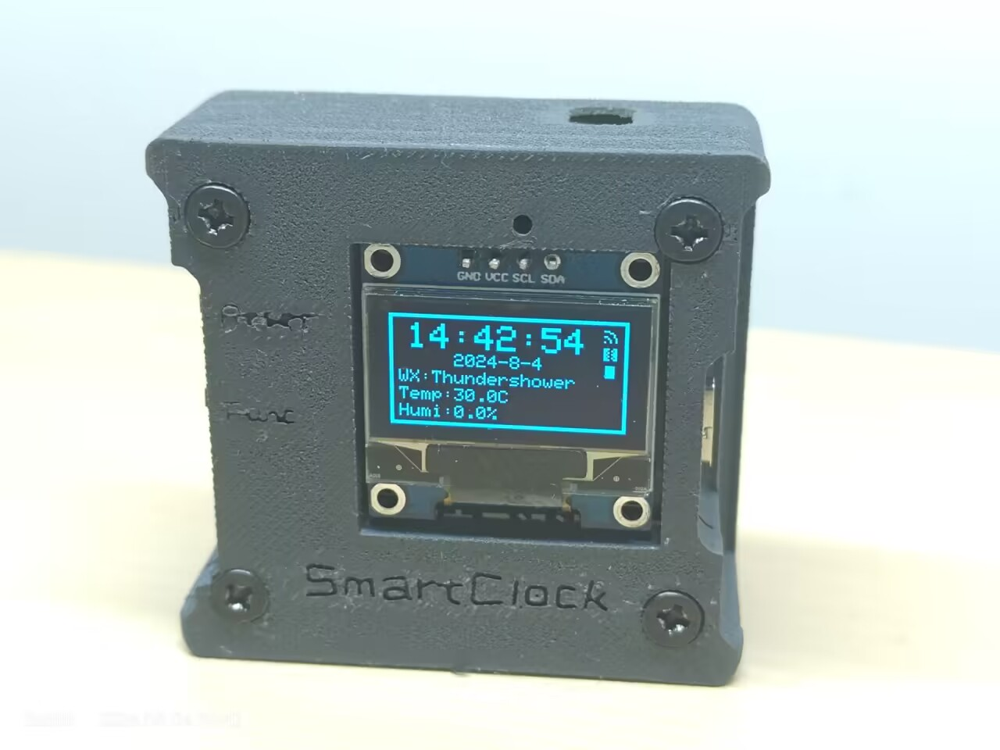
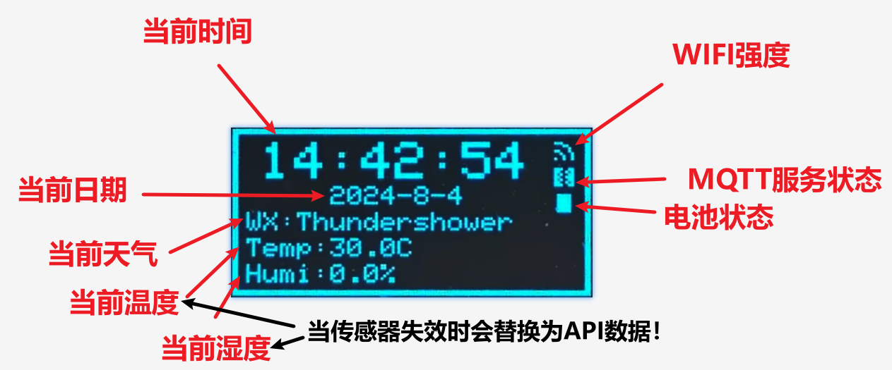
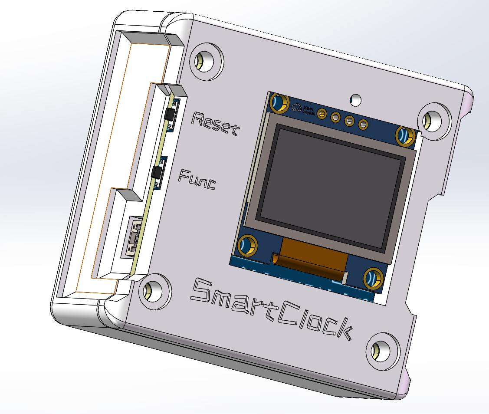
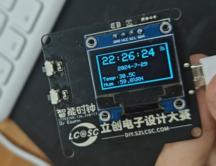

# SmartClock

如你所见，这是一个基于esp32的智能时钟项目

## 前言

本项目自开始（嘉立创第九届电子设计大赛）至结束总共花了差不多1个月时间，我是一个电设小白，我在这一个月中学习了一些奇奇怪怪有用的知识，这边感谢一下群里的各位佬对我的大力支持，我能独立做完这个项目真的很开心（快猝死了）。

## 项目介绍

本项目是一款针对现代智能家居环境设计的温湿度监测与时间管理装置，旨在解决家庭及小型办公空间对环境舒适度与时间同步管理的需求。通过集成ESP32微控制器和SHT40传感器，我实现了一套实时监测并远程报告室内温度和湿度的系统，有效提升了居住和工作环境的舒适度。~~低功耗设计~~和内置电池确保了设备的持续运行，无需频繁充电。同时，模块具备时钟功能，解决了家中或办公室缺少统一时间显示的问题，方便用户安排日程。

## 复刻金额

如果你是一个专业的电子工程师，那么复刻的成本在35RMB左右。

如果不是，那么请准备好以下工具：焊台、电烙铁、热风枪等焊接器具。

## 功能列表

- [x] 温湿度检测（盛思锐的sht40模块）
- [x] 时间显示（网络ntp）
- [x] 日期显示（时间转换）
- [x] 天气显示（心知API）
- [x] 温度过热报警
- [x] MQTT服务的支持（或许你可以连到米家上？）
- [x] 允许使用web服务器进行配置
- [x] UI图像（自己画的，勿喷）

##  文件夹目录

- Firmware：本项目的代码，基于PlatformIO平台。
- Model： 本项目的模型文件，基于soildworks 2024
- Picture：本项目的UI图片，自己PS画的
- OrderFile：下单文件
- Assets：Markdown资源文件

## 功能简介

### 主屏幕

如图所见，这是它的主屏幕。

### 按钮功能

侧边使用双按钮，分别为Reset（重置按钮）和Func（功能）

#### Reset按钮

- 重启（按1s后松开）：立马校准时钟，天气等。
- 重置（长按5s以上）：重新设置WIFI、服务器、天气API等参数。

#### Func按钮

等你创造（写一些时钟不该有的功能的任务就交给你们了！）

### 主控

采用esp32，集成WIFI、蓝牙，淘宝上15块钱包邮到家。

### 温度采集模块

采用sht40模块，可以使用嘉立创的[SHT40-AD1B with pin模块](https://item.szlcsc.com/item/24072575.html),也可以淘宝上去买这个芯片（4块包邮）

### OLED屏幕

0.96寸，淘宝应该是13左右，立创商城价格和淘宝差不多。

### 电池管理

电池采用：582728-400毫安（淘宝10块一个）

电池管理芯片：ME4064（5毛一个）

电源管理芯片：RT9013（好像也是5毛）

### PCB

这边就不得不夸一下不以卖板赚钱，以培养工程师为己任的嘉立创了，没错打板免费。（网上可以搜搜教程）

## 项目开源链接及协议

- [#第九届立创电赛#基于ESP32的多功能温度检测模块 - 嘉立创EDA开源硬件平台 (oshwhub.com)](https://oshwhub.com/esdrin/temperature-clock)
- [Esdrin/SmartClock (gitee.com)](https://gitee.com/esdrin/smart-clock)
- [Esdrin/SmartClock (github.com)](https://github.com/Esdrin/SmartClock)

本项目采用GPL3.0开源协议

## 鸣谢列表

### 提供器材以及设备

 - 嘉立创集团
 - 盛思锐

### 感谢大佬们提供技术支持

 - 灵魂惊叹符<QQ：363109993>
 - 大肚腩小鼠鼠<QQ：1597167794>
 - 嘉立创陈工

排名不分先后